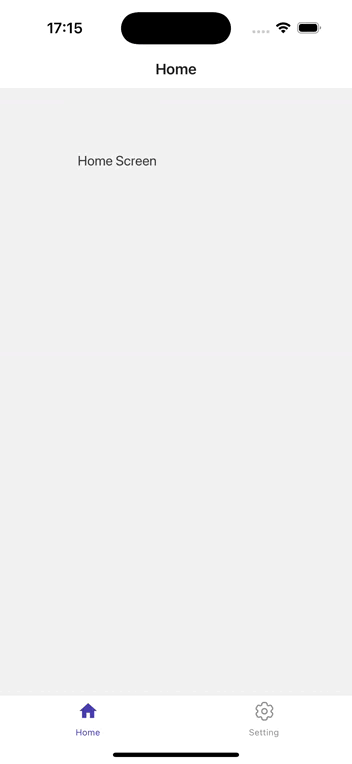

# Scalable React Native Boilerplate by Malik CHOHRA

**Sponsored by [CasaInnov](https://casainnov.com)**

## Introduction
Welcome to the Scalable React Native Boilerplate, a structured starting point for building React Native applications that are maintainable, scalable, and efficient. This boilerplate follows the best practices for organizing your codebase, setting up state management, handling API interactions, theming, and more. We use the latest React Native version and keep all libraries up to date, ensuring compatibility with the most recent features and improvements.

## Features
- **Modern Project Structure**: Organized folder layout to easily manage components, hooks, API, assets, and more.
- **Atomic Design Principles**: Component architecture based on Atomic Design for better reusability and scalability.
- **State Management**: Integrated Redux Toolkit with preconfigured actions, reducers, and selectors for managing app state.
- **API Layer**: Dedicated folder structure for handling API calls, including mock data for development and testing.
- **Theming and Styling**: Centralized theme management with a customizable design system for colors, fonts, and global styles.
- **Navigation Setup**: Modular navigation system using React Navigation for managing stacks, tabs, and nested routes.
- **Testing Setup**: Unit, integration, and end-to-end (E2E) testing configurations using Jest and Detox.
- **CI/CD with Fastlane**: Preconfigured Fastlane setup for automating builds, testing, and deployment to the App Store and Google Play.
- **Localization**: Internationalization (i18n) support with ready-to-use language configuration.
- **Latest Libraries**: All dependencies are up to date, including the latest stable versions of React Native and popular libraries.

## Project Structure with Comments
```
├── e2e                     # Detox configuration for different environments
├── Common                  # General functions and utilities for rendering screens
├── Fastlane                # CI/CD configuration using Fastlane for automated builds and deployment
├── API                     # API classes and mocked data for testing in development
├── Types                   # TypeScript type definitions for API and app data
├── Assets                  # App assets, including images, icons, and fonts
│   ├── Images              # Image assets used in the app
│   ├── Icons               # Icon assets used in the app
│   ├── Fonts               # Font files used in the app
├── Components              # Reusable components organized with Atomic Design principles
├── Containers              # Context providers and app-wide containers
├── Hooks                   # Custom hooks for reusable logic
├── I18n                    # Internationalization configuration
├── Navigation              # Navigation setup with React Navigation
├── Screens                 # App screens organized by features, with subfolders for components, hooks, and utils
├── Theme                   # Theming configuration with color and typography settings
├── Utils                   # Utility functions and helpers used across the app
├── Redux                   # Redux Toolkit setup for state management, including actions, reducers, and selectors
└── __tests__               # Unit and integration tests for components and screens
```


## Example App



## Getting Started

### Prerequisites
Make sure you have the following installed:
- Node.js (>= 14.x)
- Yarn or npm 
- Xcode (for iOS development)
- Android Studio (for Android development)

### Installation
Clone the repository:
```bash
git clone git@github.com:chohra-med/scalableReactNativeBoilerplate.git
```
Install the dependencies:
```bash
cd scalableReactNativeBoilerplate
yarn 
```
Start the development server:
```bash
yarn start
```
Run the app on iOS:
```bash
yarn ios
```
Run the app on Android:
```bash
yarn android
```

## Testing

### Unit Tests
Run unit tests with Jest:
```bash
yarn test
```

### E2E Tests
Run end-to-end tests with Detox:
```bash
yarn detox build -c ios
yarn detox test -c ios
```

## CI/CD with Fastlane
The boilerplate includes a basic Fastlane setup for automating builds, testing, and deployment.

Build the app for Android and iOS:
```bash
cd fastlane
fastlane android beta
fastlane ios beta
```

## Key Libraries and Versions
- **React Native**: 0.75.3
- **React Navigation**: v6 < 6.4.1>
- **Redux Toolkit**: For state management: 2.2.7
- **React Native Paper**: For theming and UI components: 5.12.5
- **Jest & Detox**: For testing < 20.26>
- **Fastlane**: For CI/CD <>

## Contributing
Contributions are welcome! Please follow these steps:
1. Fork the repository.
2. Create a new branch (`feature/new-feature`).
3. Commit your changes.
4. Push to the branch.
5. Open a pull request.

## License
This project is licensed under the MIT License.

## Acknowledgments
Thanks to the community for maintaining awesome libraries that make React Native development easier.

## Developed by Malik CHOHRA
For collaboration, find me on [LinkedIn](https://www.linkedin.com/in/malik-chohra/).

Visit [CasaInnov](https://casainnov.com) if you need any collaboration.
